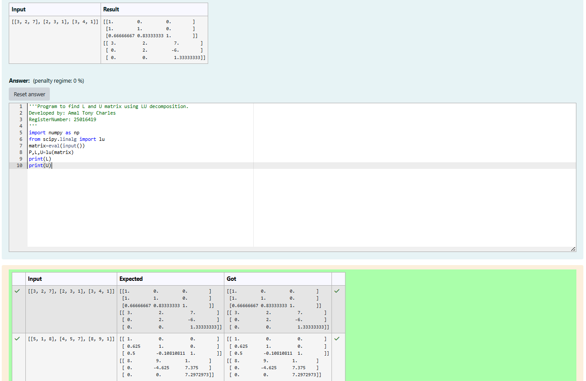
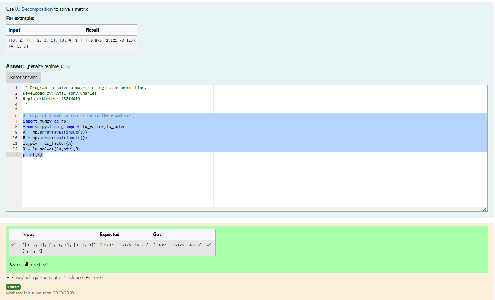

# LU Decomposition 

## AIM:
To write a program to find the LU Decomposition of a matrix.

## Equipments Required:
1. Hardware – PCs
2. Anaconda – Python 3.7 Installation / Moodle-Code Runner

## Algorithm
### Step 1:
Import required libraries numpy and scipy.linalg.

### Step 2:
Input the matrix/matrices using eval(input()).

### Step 3:
Perform LU decomposition using lu() or solve equations using lu_factor() and lu_solve().

### Step 4:
Print the results L and U matrices or solution X matrix.

## Program:
(i) To find the L and U matrix
```

Program to find the L and U matrix.
Developed by: Amal Tony Charles
RegisterNumber: 25016419

import numpy as np
from scipy.linalg import lu
matrix=eval(input())
P,L,U=lu(matrix)
print(L)
print(U)

```

(ii) To find the LU Decomposition of a matrix
``` 

Program to find the LU Decomposition of a matrix.
Developed by: 
RegisterNumber: 

# To print X matrix (solution to the equations)
import numpy as np
from scipy.linalg import lu_factor,lu_solve
A = np.array(eval(input()))
B = np.array(eval(input()))
lu,piv = lu_factor(A)
X = lu_solve((lu,piv),B)
print(X)

```

## Output:




## Result:
Thus the program to find the LU Decomposition of a matrix is written and verified using python programming.

